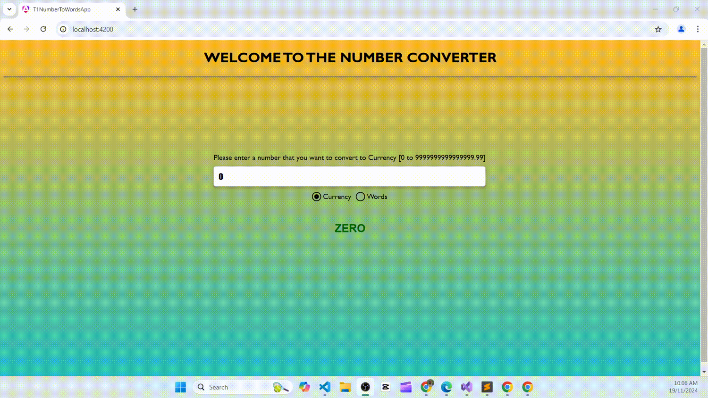

# T1NumberToWords
Web API that converts numerical input into words or currency.

# Build Instructions
----
You will need .NET 8.0 SDK for running the API. Please install .NET 8 SDK from https://dotnet.microsoft.com/en-us/download/dotnet/8.0 if not already installed.

# Hosting
----

In visual studio, open the T1NumberToWords.soln file, and select IISExpress to run the solution.
You may need to select the T1NumberToWords solution by clicking the cog button in the toolbar to choose between the test solution and the API.

# Interaction
----
When both backend and frontend projects are running, this page will be seen.

#Testing
----
Right click on the T1NumberToWords.Tests solution and click on 'Run Tests' to run the unit tests.
Unit tests have been done for the core algorithm to generate the result string for currency mode and words mode.
Also, the controller endpoint has also been unit tested using Moq's mocking features.

Please contact me at nakarmisagun33@gmail.com, if any issues with running.